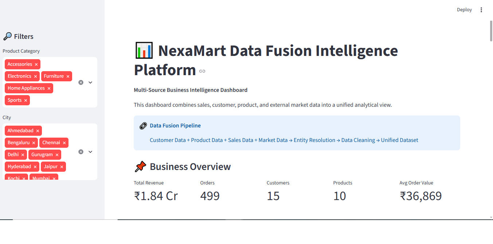
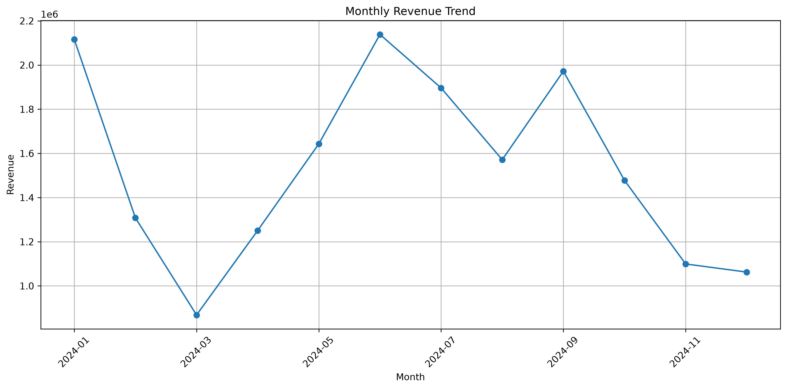
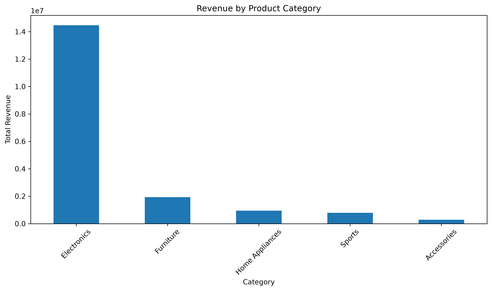
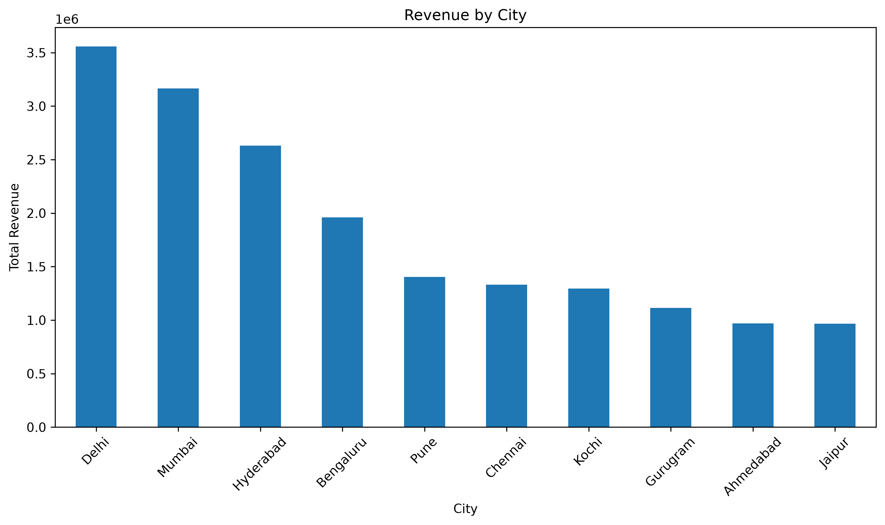
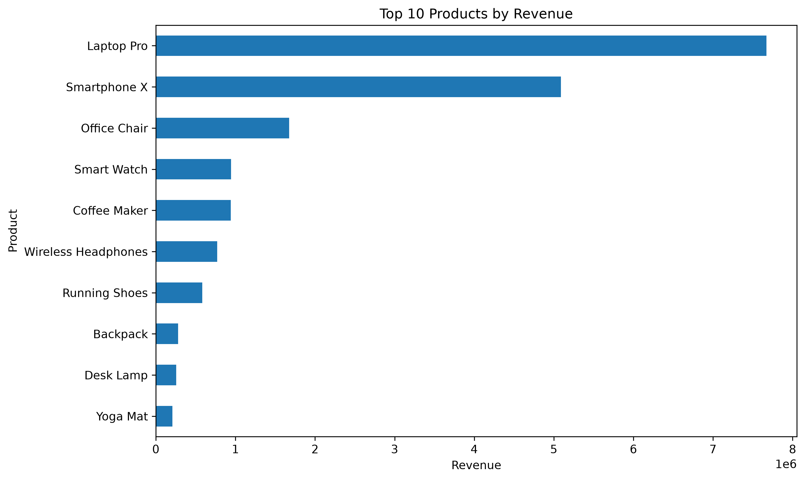
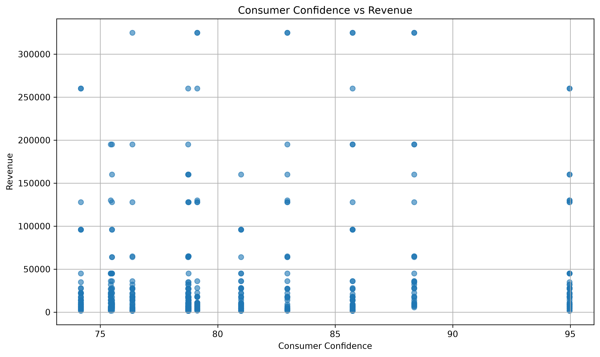
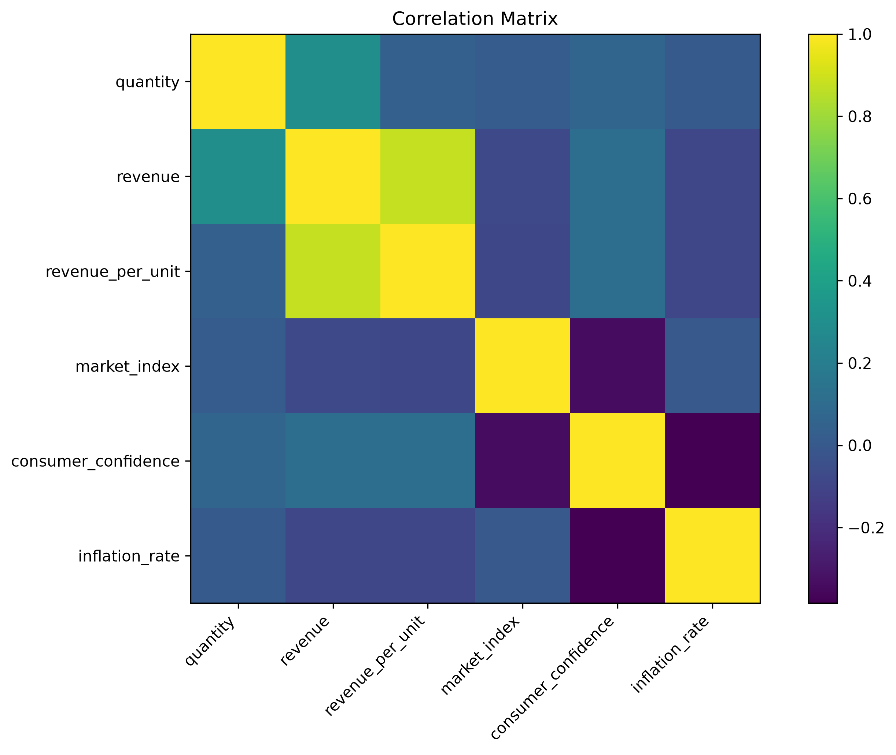

# 📊 NexaMart Multi-Source Data Fusion & Business Intelligence

<p align="center">
  <a href="images/multi_source_dashboard.png">
    
  </a>
</p>

<p align="center">
  <strong>Multi-Source Data Integration • Entity Resolution • Data Engineering • Business Intelligence</strong>
</p>

<p align="center">


</p>

## 🌐 Live Dashboard

Experience the NexaMart Multi-Source Data Fusion & Business Intelligence platform interactively.

👉 **[🚀 Launch Live Dashboard]

(https://multi-source-data-fusion-nuvykyyascufvutmgtppbj.streamlit.app/)**

The dashboard provides interactive analysis of:

- 💰 Revenue performance
- 📈 Monthly revenue trends
- 🛍️ Product categories
- 🏙️ City-wise performance
- 👥 Customer insights
- 📊 Business KPIs
- 🔎 Interactive filtering
- 🔗 Unified multi-source data

> **Note:** The dashboard is deployed using Streamlit Community Cloud.
---

## 🔗 Quick Navigation

- [📌 Project Overview](#-project-overview)
- [🎯 Business Problem](#-business-problem)
- [🎯 Project Objectives](#-project-objectives)
- [🏗️ Data Fusion Architecture](#️-data-fusion-architecture)
- [📂 Data Sources](#-data-sources)
- [🔄 Data Engineering Pipeline](#-data-engineering-pipeline)
- [🔗 Entity Resolution](#-entity-resolution--fuzzy-matching)
- [📊 Exploratory Data Analysis](#-exploratory-data-analysis)
- [📈 Dashboard](#-interactive-dashboard)
- [💡 Key Business Questions](#-key-business-questions)
- [📊 KPIs](#-key-performance-indicators)
- [🛠️ Technology Stack](#️-technology-stack)
- [📁 Project Structure](#-project-structure)
- [⚙️ Installation](#️-installation)
- [▶️ How to Run](#️-how-to-run)
- [📋 Data Quality](#-data-quality)
- [📈 Project Outcomes](#-project-outcomes)
- [🔮 Future Improvements](#-future-improvements)
- [👨‍💻 Author](#-author)

---

# 📌 Project Overview

**NexaMart Multi-Source Data Fusion & Business Intelligence** is an end-to-end data engineering, data analytics, and business intelligence project.

The project demonstrates how multiple heterogeneous datasets can be transformed into a unified analytical environment through:

- Data ingestion
- Data cleaning
- Data standardization
- Entity resolution
- Fuzzy matching
- Data fusion
- Exploratory data analysis
- Business intelligence
- Interactive dashboard development

The main objective is to convert disconnected data sources into reliable business insights that can support data-driven decision-making.

### Core Workflow

```text
Multiple Data Sources
        ↓
Data Ingestion
        ↓
Data Cleaning
        ↓
Data Standardization
        ↓
Entity Resolution
        ↓
Fuzzy Matching
        ↓
Data Fusion
        ↓
Unified Dataset
        ↓
Exploratory Data Analysis
        ↓
Business Intelligence
        ↓
Interactive Dashboard
```

---

# 🎯 Business Problem

Modern businesses collect information from multiple systems rather than a single centralized database.

For example:

```text
Customer Database
        +
Product Catalog
        +
Sales Transactions
        +
External Market Data
```

These datasets may have:

- Different formats
- Different identifiers
- Inconsistent naming conventions
- Duplicate entities
- Missing values
- Different data structures

For example, the same customer could appear as:

```text
Aditya Joshi
aditya joshi
ADITYA JOSHI
```

If these records are treated as different customers, the resulting business analysis may become inaccurate.

This project addresses the challenge by cleaning, standardizing, matching, and combining data from multiple sources.

---

# 🎯 Project Objectives

The project aims to:

- Integrate multiple heterogeneous datasets
- Clean and standardize raw data
- Identify duplicate or equivalent entities
- Apply entity resolution techniques
- Use fuzzy matching for inconsistent customer names
- Create a unified analytical dataset
- Perform exploratory data analysis
- Identify revenue and product trends
- Analyze geographical performance
- Compare business performance with external market indicators
- Build an interactive Business Intelligence dashboard

---

# 🏗️ Data Fusion Architecture

```text
                  ┌──────────────────────┐
                  │    CUSTOMER DATA     │
                  │        Excel         │
                  └──────────┬───────────┘
                             │
                             ▼
                  ┌──────────────────────┐
                  │     PRODUCT DATA     │
                  │        JSON          │
                  └──────────┬───────────┘
                             │
                             ▼
                  ┌──────────────────────┐
                  │      SALES DATA      │
                  │         CSV          │
                  └──────────┬───────────┘
                             │
                             ▼
                  ┌──────────────────────┐
                  │      MARKET DATA     │
                  │         CSV          │
                  └──────────┬───────────┘
                             │
                             ▼
                  ┌──────────────────────┐
                  │    DATA CLEANING     │
                  │  & STANDARDIZATION   │
                  └──────────┬───────────┘
                             │
                             ▼
                  ┌──────────────────────┐
                  │   ENTITY RESOLUTION  │
                  │   & FUZZY MATCHING   │
                  └──────────┬───────────┘
                             │
                             ▼
                  ┌──────────────────────┐
                  │    UNIFIED DATASET   │
                  └──────────┬───────────┘
                             │
                             ▼
                  ┌──────────────────────┐
                  │ EXPLORATORY ANALYSIS │
                  └──────────┬───────────┘
                             │
                             ▼
                  ┌──────────────────────┐
                  │ BUSINESS INTELLIGENCE│
                  │      DASHBOARD       │
                  └──────────────────────┘
```

---

# 📂 Data Sources

The project combines multiple data sources representing different areas of the business.

| Data Source | Format | Purpose |
|---|---|---|
| Customer Data | Excel | Customer information and identifiers |
| Product Data | JSON | Product catalog and attributes |
| Sales Data | CSV | Transaction-level sales |
| Market Data | CSV | External market indicators |

### Multi-Source Data Model

```text
Customer Data
      │
      ├──────────────┐
      │              │
Product Data     Sales Data
      │              │
      └───────┬──────┘
              │
        Market Data
              │
              ▼
       Unified Dataset
```

---

# 🔄 Data Engineering Pipeline

## 1️⃣ Data Ingestion

The pipeline loads data from different file formats:

```text
Excel → Customer Data
JSON  → Product Data
CSV   → Sales Data
CSV   → Market Data
```

---

## 2️⃣ Data Cleaning

The raw datasets are checked and cleaned for:

- Missing values
- Duplicate records
- Invalid values
- Incorrect data types
- Formatting inconsistencies

---

## 3️⃣ Data Standardization

Important fields are standardized before matching.

Example:

```text
" Aditya Joshi "
"aditya joshi"
"ADITYA JOSHI"
```

can be normalized into:

```text
aditya joshi
```

---

## 4️⃣ Entity Resolution

Customer records are compared across datasets using:

- Text normalization
- String standardization
- Similarity scoring
- Fuzzy matching
- Confidence classification

---

## 5️⃣ Data Fusion

After cleaning and entity resolution, the datasets are combined into a unified analytical dataset.

---

## 6️⃣ Exploratory Data Analysis

The unified dataset is analyzed to identify:

- Revenue trends
- Category performance
- City performance
- Product performance
- Customer patterns
- Market relationships

---

## 7️⃣ Business Intelligence

The final insights are presented through an interactive Streamlit dashboard.

---

# 🔗 Entity Resolution & Fuzzy Matching

Entity resolution is a core component of this project.

The objective is to determine whether records from different sources represent the same real-world entity.

### Example

```text
Source A → Aditya Joshi
Source B → aditya joshi
Source C → ADITYA JOSHI
```

### Matching Workflow

```text
Raw Records
     ↓
Text Normalization
     ↓
Standardization
     ↓
Fuzzy Matching
     ↓
Similarity Score
     ↓
Confidence Level
     ↓
Resolved Entity
```

### Match Categories

| Category | Description |
|---|---|
| High Confidence | Strong similarity between records |
| Alias Match | Likely variation of an existing entity |
| Unknown | No reliable match identified |

---

# 📊 Exploratory Data Analysis

The unified dataset is analyzed across multiple business dimensions.

---

## 📈 Monthly Revenue Trend

The monthly revenue analysis helps identify changes in business performance over time.

### Analysis Image

[](images/monthly_revenue_trend.png)

**Click the image to open the full-size visualization.**

---

## 🏷️ Revenue by Category

This analysis compares revenue contribution across product categories.

### Analysis Image

[](images/revenue_by_category.png)

**Click the image to open the full-size visualization.**

---

## 🏙️ Revenue by City

This analysis compares revenue performance across different cities.

### Analysis Image

[](images/revenue_by_city.png)

**Click the image to open the full-size visualization.**

---

## 🏆 Top 10 Products

This visualization identifies the products generating the highest revenue.

### Analysis Image

[](images/top_10_products.png)

**Click the image to open the full-size visualization.**

---

## 🌐 Consumer Confidence vs Revenue

This analysis explores the relationship between consumer confidence and business revenue.

### Analysis Image

[](images/consumer_confidence_vs_revenue.png)

**Click the image to open the full-size visualization.**

---

## 🔗 Correlation Analysis

The correlation matrix provides an overview of relationships between important business and market variables.

### Analysis Image

[](images/correlation_matrix.png)

**Click the image to open the full-size visualization.**

---

# 📈 Interactive Dashboard

## NexaMart Data Fusion Intelligence Platform

The final analytical results are presented through an interactive Business Intelligence dashboard built using Streamlit.

The dashboard combines the processed datasets into a single interactive analytical environment.

---

## 🏠 Dashboard Overview

The dashboard provides a high-level view of the business performance.

[](images/dashboard_overview.png)

**Click the image to open the full-size dashboard screenshot.**

---

## 💰 Revenue Analysis Dashboard

The revenue dashboard focuses on revenue performance and trends.

[](images/revenue_trend.png)

**Click the image to open the full-size dashboard screenshot.**

---

# 🎛️ Dashboard Features

### 📌 Business Overview

The dashboard provides key business metrics such as:

- Total Revenue
- Total Orders
- Total Customers
- Total Products
- Average Order Value

### 🔎 Interactive Filters

Users can explore the dashboard using filters such as:

- Product Category
- City

### 📈 Revenue Analysis

Analyze revenue trends across different periods.

### 🏷️ Category Analysis

Compare revenue generated by different product categories.

### 🏙️ City Analysis

Identify cities contributing the highest revenue.

### 🏆 Product Analysis

Identify top-performing products.

### 🌐 Market Analysis

Explore relationships between business performance and external market indicators.

---

# 💡 Key Business Questions

The project is designed to answer questions such as:

1. Which product categories generate the highest revenue?
2. Which cities contribute the most revenue?
3. Which products are the strongest performers?
4. How does revenue change over time?
5. Which customers contribute significantly to sales?
6. Is consumer confidence related to revenue?
7. Is inflation related to business performance?
8. What relationships exist between market indicators and sales?
9. How effectively can customer entities be resolved?
10. How can heterogeneous datasets be transformed into one reliable analytical environment?

---

# 📊 Key Performance Indicators

| KPI | Description |
|---|---|
| 💰 Total Revenue | Overall revenue generated |
| 🛒 Total Orders | Number of transactions |
| 👥 Total Customers | Number of unique customers |
| 📦 Total Products | Number of products |
| 💵 Average Order Value | Average revenue per order |

---

# 🛠️ Technology Stack

## Programming

- Python

## Data Processing

- Pandas
- NumPy

## Visualization

- Matplotlib
- Plotly

## Dashboard

- Streamlit

## Development Tools

- VS Code
- Jupyter Notebook
- Git
- GitHub

## Data Engineering Techniques

- Data Ingestion
- Data Cleaning
- Data Standardization
- Entity Resolution
- Fuzzy Matching
- Multi-Source Data Fusion

---

# 📁 Project Structure

```text
multi-source-data-fusion/
│
├── data/
│   ├── raw/
│   ├── external/
│   └── processed/
│
├── dashboard/
│   └── app.py
│
├── images/
│   ├── monthly_revenue_trend.png
│   ├── revenue_by_category.png
│   ├── revenue_by_city.png
│   ├── top_10_products.png
│   ├── consumer_confidence_vs_revenue.png
│   ├── correlation_matrix.png
│   ├── dashboard_overview.png
│   └── revenue_trend.png
│
├── notebooks/
│   └── multi_source_eda.ipynb
│
├── src/
│   ├── generate_data.py
│   ├── data_ingestion.py
│   ├── data_cleaning.py
│   └── entity_resolution.py
│
├── README.md
├── requirements.txt
├── LICENSE
└── .gitignore
```

---

# 🔗 Project Resources

| Resource | Description |
|---|---|
| 📊 [Dashboard](dashboard/) | Streamlit dashboard |
| 💻 [Source Code](src/) | Data processing and entity-resolution scripts |
| 📓 [EDA Notebook](notebooks/) | Exploratory data analysis |
| 📂 [Raw Data](data/raw/) | Raw datasets |
| 📂 [External Data](data/external/) | External market data |
| 📂 [Processed Data](data/processed/) | Processed datasets |
| 🖼️ [Analysis Images](images/) | Project visualizations |

---

```

---

## Launch the Dashboard

```bash
python -m streamlit run dashboard/app.py
```

The dashboard will be available at:

http://localhost:8501
```

---

# 🔁 Complete Project Workflow

```text
                    ┌─────────────────┐
                    │  DATA SOURCES   │
                    └────────┬────────┘
                             ↓
                    ┌─────────────────┐
                    │ DATA INGESTION  │
                    └────────┬────────┘
                             ↓
                    ┌─────────────────┐
                    │ DATA CLEANING   │
                    └────────┬────────┘
                             ↓
                    ┌─────────────────┐
                    │ STANDARDIZATION │
                    └────────┬────────┘
                             ↓
                    ┌─────────────────┐
                    │ENTITY RESOLUTION│
                    └────────┬────────┘
                             ↓
                    ┌─────────────────┐
                    │   DATA FUSION   │
                    └────────┬────────┘
                             ↓
                    ┌─────────────────┐
                    │ UNIFIED DATASET │
                    └────────┬────────┘
                             ↓
                    ┌─────────────────┐
                    │      EDA        │
                    └────────┬────────┘
                             ↓
                    ┌─────────────────┐
                    │ BUSINESS INTEL. │
                    └────────┬────────┘
                             ↓
                    ┌─────────────────┐
                    │   DASHBOARD     │
                    └─────────────────┘
```

---

# 📋 Data Quality

Data quality is an important part of the project.

The pipeline considers:

- Missing values
- Duplicate records
- Invalid records
- Inconsistent customer names
- Data-type mismatches
- Entity matching confidence
- Standardization consistency

Improving data quality helps ensure that the final business analysis is reliable.

---

# 📈 Project Outcomes

The project demonstrates practical implementation of:

- ✅ Multi-source data ingestion
- ✅ Data cleaning
- ✅ Data standardization
- ✅ Entity resolution
- ✅ Fuzzy matching
- ✅ Data fusion
- ✅ Unified dataset creation
- ✅ Exploratory data analysis
- ✅ Business KPI development
- ✅ Data visualization
- ✅ Interactive dashboard development
- ✅ Business intelligence

---

# 🧠 Why This Project Is Different

Unlike a traditional analytics project based on a single CSV file, this project demonstrates the complete journey from multiple raw data sources to a unified business intelligence platform.

```text
Multiple Raw Sources
        ↓
Data Engineering
        ↓
Entity Resolution
        ↓
Data Fusion
        ↓
Business Analytics
        ↓
Interactive BI Dashboard
```

### Key Differentiators

- Multi-source data integration
- Entity resolution
- Fuzzy matching
- Data engineering workflow
- Business intelligence
- Interactive visualization
- End-to-end analytical architecture

---

# 🎓 Skills Demonstrated

### Technical Skills

- Python
- Pandas
- NumPy
- Matplotlib
- Plotly
- Streamlit
- Git
- GitHub

### Data Skills

- Data Cleaning
- Data Preprocessing
- Data Integration
- Data Fusion
- Entity Resolution
- Fuzzy Matching
- Exploratory Data Analysis
- Data Visualization

### Business Skills

- KPI Development
- Business Analysis
- Trend Analysis
- Market Analysis
- Business Intelligence
- Data-Driven Decision Making

---

# 🔮 Future Improvements

Potential improvements include:

- Real-world public datasets
- Automated ETL pipelines
- Machine-learning-based entity matching
- Real-time market data integration
- Cloud-based data storage
- Automated data-quality monitoring
- Customer segmentation
- Revenue forecasting
- Anomaly detection
- Predictive analytics
- Docker deployment
- Cloud deployment
- CI/CD automation

---

# 🚀 Future Production Architecture

```text
Multiple Data Sources
        ↓
Cloud Storage
        ↓
ETL / ELT Pipeline
        ↓
Data Quality Layer
        ↓
Entity Resolution Engine
        ↓
Data Warehouse
        ↓
Analytics Layer
        ↓
BI Dashboard
        ↓
Business Decisions
```

---

# 👨‍💻 Author

## Kshitiz Goyal

**BCA | Aspiring Data Analyst & Data Engineer**

### Areas of Interest

- Data Analytics
- Data Engineering
- Artificial Intelligence
- Machine Learning
- Generative AI
- Business Intelligence

---

# ⭐ Support

If you find this project useful or interesting, consider giving the repository a ⭐ on GitHub.

---

<p align="center">
  <strong>Built with Python • Pandas • Plotly • Streamlit</strong>
</p>

<p align="center">
  📊 Data → 🔗 Fusion → 🧠 Intelligence → 📈 Decisions
</p>